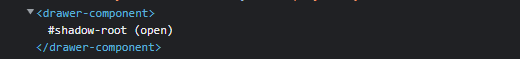
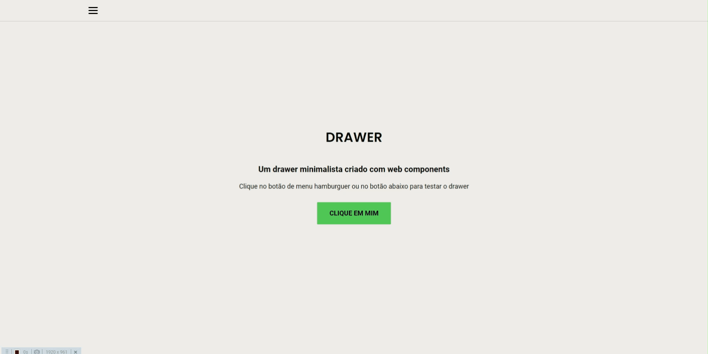

# Drawer Component

Component criado com shadow DOM


## Como criar um web component em javascript
Para criar um **web component** precisamos referenciar um **nome** para o componente e a **classe** no *método* ```customElements.define()```
A classe criada deve extender alguma interface HTML como ***HTMLElement***
```javascript
class Drawer extends HTMLElement{
    constructor(){
        super()
    }
}
customElements.define('drawer-component',Drawer)
```
Agora devemos importá-lo no nosso arquivo **HTML**
```html
<head>
    <script src="drawer.js" defer> </script>
</head>
```
e definir em nosso documento
```html
<body>
    <drawer-component></drawer-component>
    <!--
         ou 
    <drawer-component/>
    -->
</body>
```
Agora precisamos criar o _shadowDOM_, cujo conceitos podem ser entendidos [aqui](https://developer.mozilla.org/en-US/docs/Web/Web_Components/Using_shadow_DOM)

Para fazer isso usamos 
```
this.shadow = this.attachShadow({mode:'open'})
 ```
se inspecionarmos a nossa página no navegador a **shadowRoot** já se mostrará funcional



Agora vamos criar o drawer

Podemos utilizar o callback ```connectedCallback()```, que é executado sempre que o _customElement_ é conectado ao conteúdo

e dentro do nosso callback é onde será definido o conteúdo html do componente
```javascript 
    connectedCallback(){
        this.shadow.innerHTML = `
        <div class="drawer">
            <slot>
                <h1>!</h1>
            </slot>
        </div>`
    }
```

A tag ```<slot>``` faz com que os elemento filhos do nosso drawer sejam exibidos dentro da ```<div class="drawer"> ```

Antes de estilizar o nosso drawer vamos definir algumas propriedades que poderão ser alteradas no nosso documento html

Para isso devemos criar um método estático que observa a alteração dos atributos
e retorna as propriedades
```javascript
    static get observedAttributes(){
        return ['shadow','opener','fixed']
    }
```
Também é preciso um método que reconecta nosso **shadowRoot** quando uma propriedade for alterada
```javascript
    attributeChangedCallback(attr, oldValue, newValue) {
        this.connectedCallback()
    }
```
Agora Estilizamos o drawer
```javascript
this.shadow.innerHTML = `
        <style>
            .drawer{
            padding:0 1em;
            display:flex;
            flex-direction: column;
            transition:0.5s;
            top:0;
            left:0;
            position: fixed;
            width: 250px;
            height: 100%;
            background-color: #fff;
            z-index:1199;
            box-shadow: 0px 0px 9px 2px rgba(0,0,0,0.75);
                
        }
        </style>
         <div class="drawer">
            <slot>
                <h1></h1>
            </slot>
        </div> 
```
vamos definir os valores padrões para as propriedades definidas
```javascript
    let isOpen = false
    let shadowOpt = false
    let fixed = "none" 
```

agora para verificarmos se as propriedades foram definidas na tag faça isso no _connectedCallback()_
```javascript
    if (this.hasAttribute('shadow')) {
            shadowOpt = this.getAttribute('shadow')
    }
    if (this.hasAttribute('fixed')) {
            fixed = this.getAttribute('fixed')
        }
 ```
caso as condicionais sejam verdadeiras os valores das variáveis serão alterados
a propriedade ***opener*** será usada para definir os botões que interagem com o drawer por isso devemos usar uma estrutura de repetição para verificar todos os botões e adicionar o evento ```click()```
```javascript
 if (this.hasAttribute('opener')) {
            this.buttons.forEach(btn => btn.addEventListener('click', () => {
                if (fixed != "true") {
                    this.manageDrawer(isOpen, shadowOpt)
                    isOpen = !isOpen
                }
            }))
        } else {
            fixed = "true"
        }

```
caso a propriedade fixed seja true, os botões nao funcionarão
agora vamos criar a função ```manageDrawer()```
```javascript
    manageDrawer(bool, shadowOpt) {
        
        if (!bool) {
            this.buttons.forEach(btn => btn.classList.add('open'))
            this.shadow.querySelector('.drawer').style.left = 0
            
            if (shadowOpt) {
                this.openShadow()
            }

        } else {

            this.buttons.forEach(btn => btn.classList.remove('open'))
            this.shadow.querySelector('.drawer').style.left = "-300px"

            if (shadowOpt) {
                this.closeShadow()
            }
        }
    }
```
Esta função recebe 2 valores booleanos, um para verificar se o drawer está aberto ou fechado e o outro para verificar se o drawer terá uma sombra
para abrir e fechar a sombra criaremos as funções ```openShadow()``` e ```closeShadow()```
```javascript
    openShadow() {
        setTimeout(() => {
            this.shadow.lastElementChild.style.opacity = 0.5
        }, 100)
        this.shadow.lastElementChild.style.display = 'block'
    }
    closeShadow() {
        this.shadow.lastElementChild.style.opacity = 0
        this.shadow.querySelector('.drawer').style.left = '-300px'
        this.buttons.forEach(btn => btn.classList.remove('open'))
        this.shadow.lastElementChild.style.display = 'none'
    }
```
as linhas com ```classList.add``` e ```classList.remove``` adicionam e removem respectivamente a classe open nos botões que podem ser usadas pelo usuário para criar uma estilização condicional nos botões
agora precisamos adicionar o elemento que funcionará como sombra, o seu estilo e a condicional para que ele seja utilizado

para isso adicione no nosso ```this.shadow.innerHTML``` o seguinte código
``` javascript
    this.shadow.innerHTML = `<style>
        .drawer{
            padding:0 1em;
            display:flex;
            flex-direction: column;
            transition:0.5s;
            top:0;
            left:0;
            position: fixed;
            width: 250px;
            height: 100%;
            background-color: #fff;
            z-index:1199;
            box-shadow: 0px 0px 9px 2px rgba(0,0,0,0.75);
                
        }
        .shadow{
            width:100vw;
            height:100%;
            background: rgb(0,0,0);
            position:fixed;
            display:none;
            transition:0.5s;
            opacity:0;
            top:0;
            left:0;
        }
        </style>
        
        <div class="drawer">
            <slot>
                <h1>!</h1>
            </slot>
        </div>
        ${shadowOpt ? '<div class="shadow"></div>' : ''}
        `
```
para definir se o drawer será **fixo** ou não, troque ```left:0``` por ```${fixed != "true" ? "left: -300px" : "left: 0 !important"};``` 

adicione uma função no final do ```connectedCallback()``` para fechar a sombra quando clicar com
```javascript 
    this.shadow.lastElementChild.onclick = () => {
            isOpen = false
            this.closeShadow()
        }
```

Para encontrar os botões precisamos adicionar no **construtor**
```this.buttons = document.querySelectorAll(this.getAttribute('opener'))```


## Uso
Como o drawer não recebeu ainda nenhum elemento para ser o botão ele ficará sempre aberto

podemos definir os elementos a serem utilizados com a propriedade opener
```html
<body>
    <button class="botao">clique em mim</button>
    <drawer-component opener=".botao"></drawer-component>
</body>
para adicionar a sombra shadow="true"
```


## Exemplos

- Sem Sombra

- Fixo

- Com sombra

